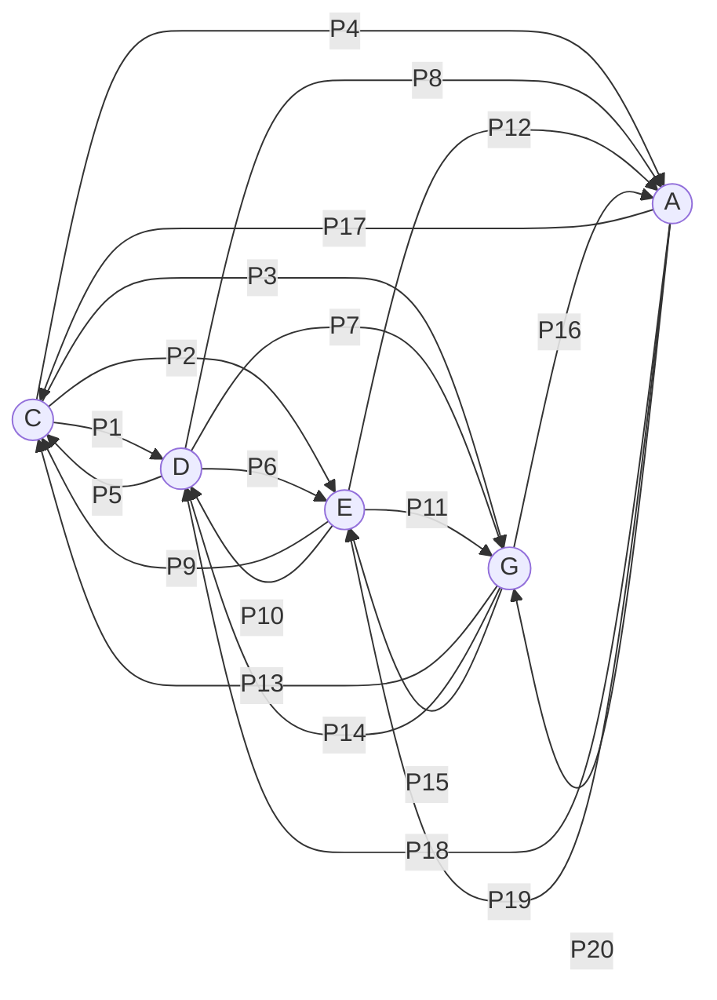
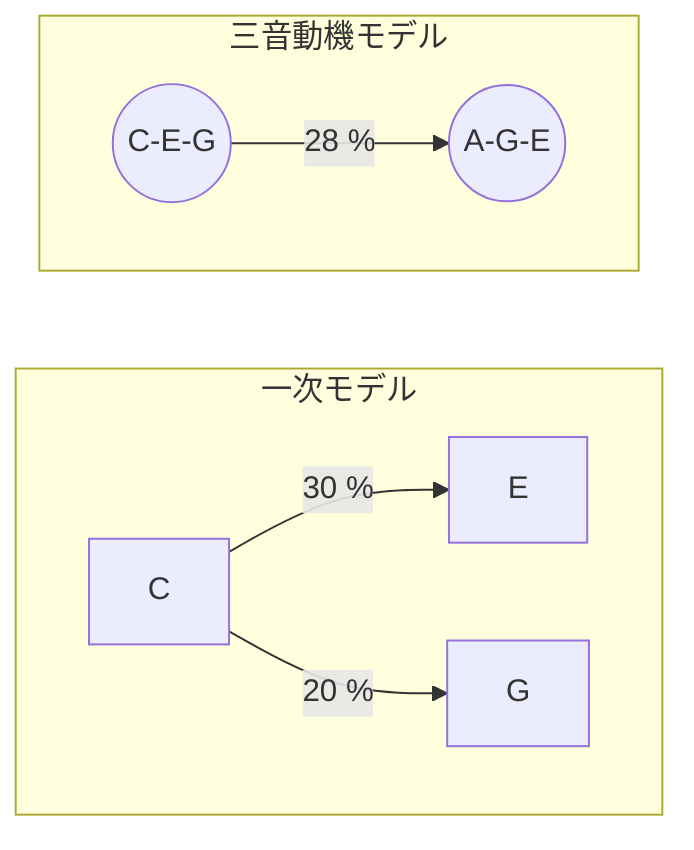

# aaa

```mermaid

graph LR
%% Pentatonic single-note Markov chain (simplified)
C((C))
D((D))
E((E))
G((G))
A((A))

    %% Outgoing transitions from each state
    C -- P1 --> D
    C -- P2 --> E
    C -- P3 --> G
    C -- P4 --> A

    D -- P5 --> C
    D -- P6 --> E
    D -- P7 --> G
    D -- P8 --> A

    E -- P9 --> C
    E -- P10 --> D
    E -- P11 --> G
    E -- P12 --> A

    G -- P13 --> C
    G -- P14 --> D
    G -- P15 --> E
    G -- P16 --> A

    A -- P17 --> C
    A -- P18 --> D
    A -- P19 --> E
    A -- P20 --> G

```

```mermaid

graph LR

    subgraph 一次モデル
        direction LR
        C1[C] -->|30 %| E1[E]
        C1 -->|20 %| G1[G]
    end

    subgraph 三音動機モデル
        direction LR
        CEG((C-E-G)) -->|28 %| AGE((A-G-E))
    end


```
